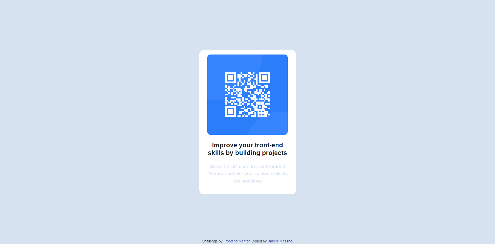

# Frontend Mentor - QR code component solution

This is a solution to the [QR code component challenge on Frontend Mentor](https://www.frontendmentor.io/challenges/qr-code-component-iux_sIO_H). Frontend Mentor challenges help you improve your coding skills by building realistic projects. 

## Table of contents

- [Overview](#overview)
  - [Screenshot](#screenshot)
  - [Links](#links)
- [My process](#my-process)
  - [Built with](#built-with)
  - [What I learned](#what-i-learned)
  - [Continued development](#continued-development)
- [Author](#author)

## Overview

### Screenshot

### Links

- Solution URL: [https://www.frontendmentor.io/solutions/qr-code-component-2gOkZwXyj8]
- Live Site URL: [https://loquacious-nougat-c74b3a.netlify.app/]
- GitHub URL: [https://github.com/Sabelo-Mdashe/qr-code-component-main]

## My process

### Built with

- Semantic HTML5 markup
- CSS custom properties
- Flexbox
- Mobile-first workflow
- [Google Fonts](https://fonts.google.com/specimen/Outfit) - For fonts

### What I learned

I did not really learn anything new I didn't know before, but this project was fun enough as it reminded me the joy of getting your hands dirty by doing some actual code. I've been using Wordpress for a month and I almost forgot the fun of coding.

### Continued development

I need to do more coding especially CSS and JavaScript because they have the most complex concepts that can be easily forgotten if you haven't coded a while.

## Author

- Website - [Sabelo Mdashe](http://sabelomdashe.co.za)
- Frontend Mentor - [@Sabelo-Mdashe](https://www.frontendmentor.io/profile/Sabelo-Mdashe)
- LinkedIn - [Sabelo Mdashe](https://www.linkedin.com/in/sabelo-mdashe)
